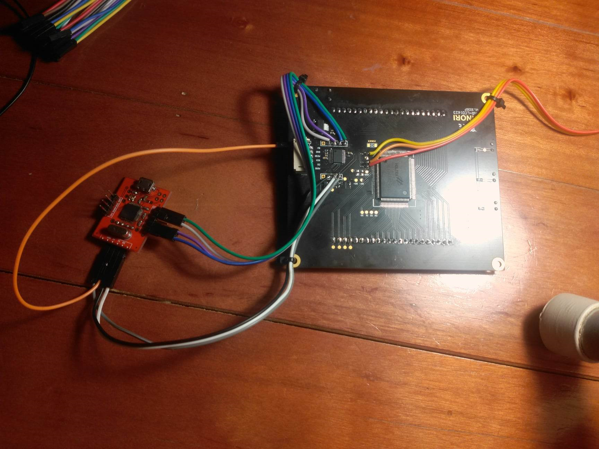
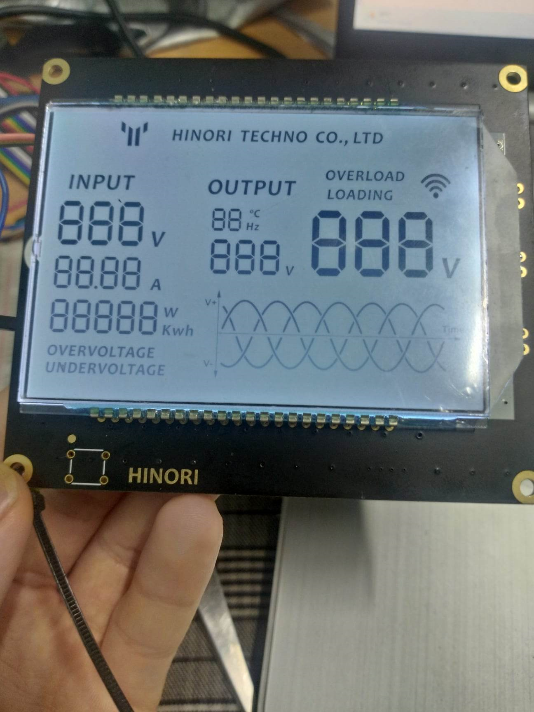
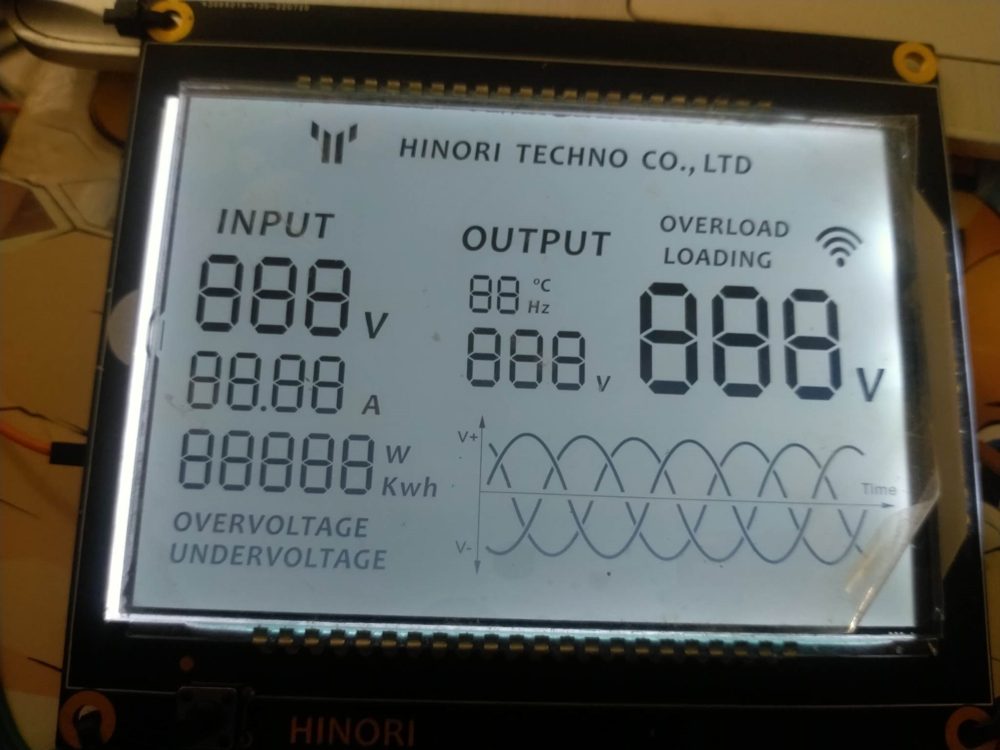
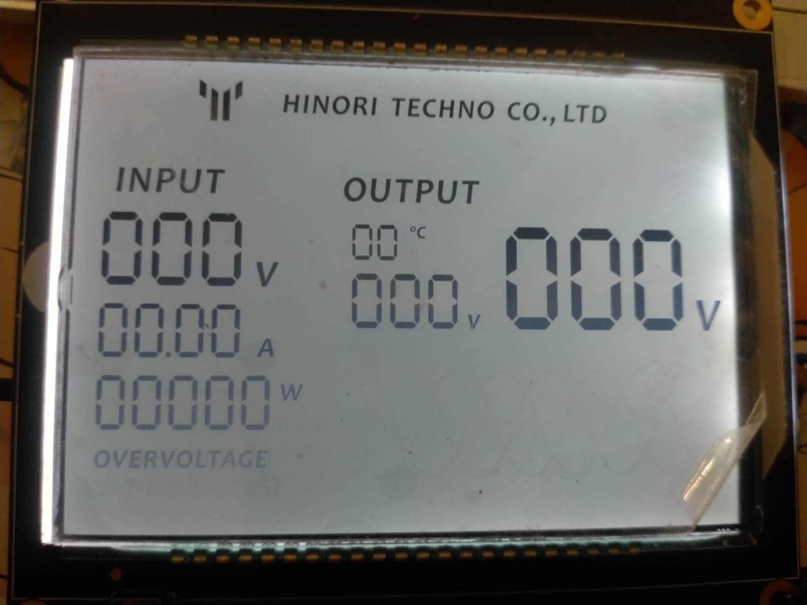
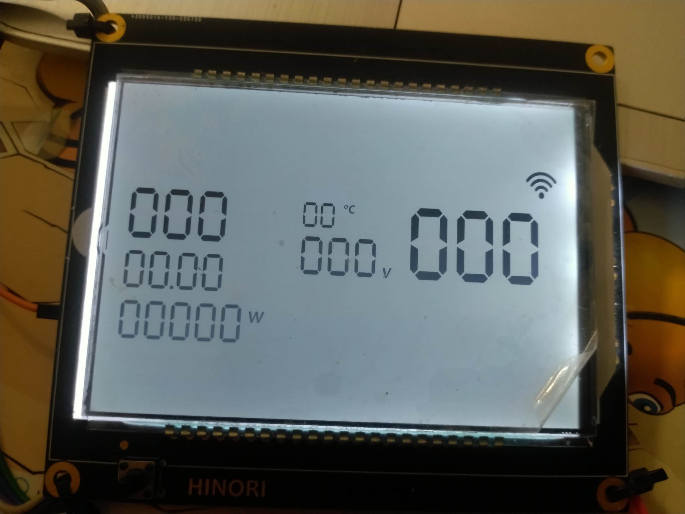
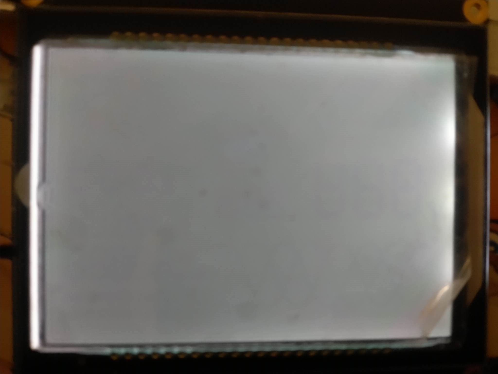

# Báo cáo công việc Hinori

## 1. Kết nối
- Theo hướng dẫn của Thế Anh kết nối trực tiếp jlink với màn hình ta được cách kết nối sau:
### kết nối UART
|	màn hình  |  Jlink | 
|-------|--------------|
| GND   |	GND       |
| 5V (lấy từ port SPI)	|	5V	|
|	TX	|	TX	|
|	RX    |	RX	|

### kết nối Jlink
|	màn hình  |  Jlink | 
|-------|--------------|
| RST  |	không kết nối    |
| 3v3	|	3v3	|
|	SWDIO	|	SWD	|
|	SWCLK    |	CLK	|
|   GND   |   GND  |

 
- Sau khi kết nối như trên màn hình sẽ hiển thị như sau:
 

## 2. Tìm hiểu và giải thích các hàm trong lập trình màn hình Hinori

### A.Trên chip HT1623
- _write_bit(): chế độ viết
- _cmdMode(): chế độ command
- HT1623_Digit_X(value,status,addr) : in số ra digit X [code](https://github.com/haduchieu-lab/bao_cao_lab/blob/5d2e2ce467dd3985ea58c0cf7a2109219095deb6/HT1623.c#L106-L304)
  - x=1,2,3,4
  - value giá trị từ 0 đến 9
  - status: enable(EN) hoặc disable(DIS)
  - addr: DIGIT1_ADDR; DIGIT2_ADDR; DIGIT3_ADDR; DIGIT4_ADDR

- HT1623_SR(addr,status,type): in ra  trạng thái lên màn hình [code](https://github.com/haduchieu-lab/bao_cao_lab/blob/5d2e2ce467dd3985ea58c0cf7a2109219095deb6/HT1623.c#L354-L373)
  - addr: địa chỉ thanh ghi muốn in
  - status: EN hoặc DIS
- _convert_7_segment(value): đưa value về dạng bit hiển thị trên led 7 đoạn [code](https://github.com/haduchieu-lab/bao_cao_lab/blob/5d2e2ce467dd3985ea58c0cf7a2109219095deb6/HT1623.c#L307-L331)
- HT1623_ClearSR(): xóa các cờ trạng thái

### B.LCD
- LCD_INIT_MODE(): hiển thị tất cả các phần tử lên màn hình [code](https://github.com/haduchieu-lab/bao_cao_lab/blob/2d5e773cbde393271c18c0c3fceb7d3a361dd67d/LCD_HINORI.c#L330-L365)

- LCD_NORMAL_X_MODE(void) : hiển thị trên màn hình trạng thái X có đồ thị sin
  - X = LOADING ; OVERVOLTAGE ; UNDERVOLTAGE ; OVERLOAD  [code](https://github.com/haduchieu-lab/bao_cao_lab/blob/2d5e773cbde393271c18c0c3fceb7d3a361dd67d/LCD_HINORI.c#L173-L258)
- LCD_ABNORMAL_X_MODE(void): hiển thị lên màn hình trạng thái X nhưng không có đồ thị sin
   - X = LOADING ; OVERVOLTAGE ; UNDERVOLTAGE ; OVERLOAD [code](https://github.com/haduchieu-lab/bao_cao_lab/blob/2d5e773cbde393271c18c0c3fceb7d3a361dd67d/LCD_HINORI.c#L260-L328)

- LCD_STANBY_MODE(void): chỉ hiển thị số [code](https://github.com/haduchieu-lab/bao_cao_lab/blob/2d5e773cbde393271c18c0c3fceb7d3a361dd67d/LCD_HINORI.c#L367-L392)

- LCD_RESET_MODE(void): xóa tất cả ký tự trên màn hình [code](https://github.com/haduchieu-lab/bao_cao_lab/blob/2d5e773cbde393271c18c0c3fceb7d3a361dd67d/LCD_HINORI.c#L394-L425)

- LCD_VOLTAGE_IN(): in ra màn hình giá trị _voltage_in  đọc được [code](https://github.com/haduchieu-lab/bao_cao_lab/blob/2d5e773cbde393271c18c0c3fceb7d3a361dd67d/LCD_HINORI.c#L427-L433)
- LCD_AMP_IN(): in ra màn hình giá trị amp đọc được    [code](https://github.com/haduchieu-lab/bao_cao_lab/blob/2d5e773cbde393271c18c0c3fceb7d3a361dd67d/LCD_HINORI.c#L435-L451)
- LCD_VOLTAGE_OUTX():hiển thị voltage out tại vị trí x (x=1,2)  [code](https://github.com/haduchieu-lab/bao_cao_lab/blob/2d5e773cbde393271c18c0c3fceb7d3a361dd67d/LCD_HINORI.c#L453-L467)
- LCD_TEMPERATURE_FREQ(): hiển thị nhiệt độ hoặc tần số (tần số và nhiệt độ xếp cùng 1 ô hiển thị)  [code](https://github.com/haduchieu-lab/bao_cao_lab/blob/2d5e773cbde393271c18c0c3fceb7d3a361dd67d/LCD_HINORI.c#L503-L522)
- LCD_GRAPH(): đồ thị tự chạy khi ở chế độ NORMAL_OVERVOLTAGE,NORMAL_UNDERVOLTAG,NORMAL_OVERLOAD,ABNORMAL_OVERVOLTAGE   [code](https://github.com/haduchieu-lab/bao_cao_lab/blob/2d5e773cbde393271c18c0c3fceb7d3a361dd67d/LCD_HINORI.c#L524-L544)
- LCD_OVERVOLTAGE(void): kiểm tra liệu giá trị có ở OVERVOLTAGE; OVERVOLTAGE; UNDERVOLTAGE; OVERLOAD   [code](https://github.com/haduchieu-lab/bao_cao_lab/blob/2d5e773cbde393271c18c0c3fceb7d3a361dd67d/LCD_HINORI.c#L546-L567)

- LCD_Set_X(uint8_t val): hiển thị val tại các led 7 đoạn tướng ứng chế độ X (sử dụng bảng dưới)   [code](https://github.com/haduchieu-lab/bao_cao_lab/blob/5d2e2ce467dd3985ea58c0cf7a2109219095deb6/LCD_HINORI.c#L619-L669)
- LCD_Set_Mode(mode_spi): xác định chế độ, mode_spi chạy từ 0->9 (sử dụng bảng dưới)   [code](https://github.com/haduchieu-lab/bao_cao_lab/blob/5d2e2ce467dd3985ea58c0cf7a2109219095deb6/LCD_HINORI.c#L588-L617)

|   X           | mode_spi |
|--------------|-------|
| init 		|	0	|
| STANBY		|					1	|
| NORMAL_LOADING	|				2	|				
| NORMAL_OVERVOLTAGE|			3		|					
| NORMAL_UNDERVOLTAGE	|	4			|				
| NORMAL_OVERLOAD		|	5			|		
| ABNORMAL_OVERVOLTAGE |	6			|	
| ABNORMAL_UNDERVOLTAGE |		7		|						
| ABNORMAL_OVERLOAD	|	8			|			
| RESET		|		9				|